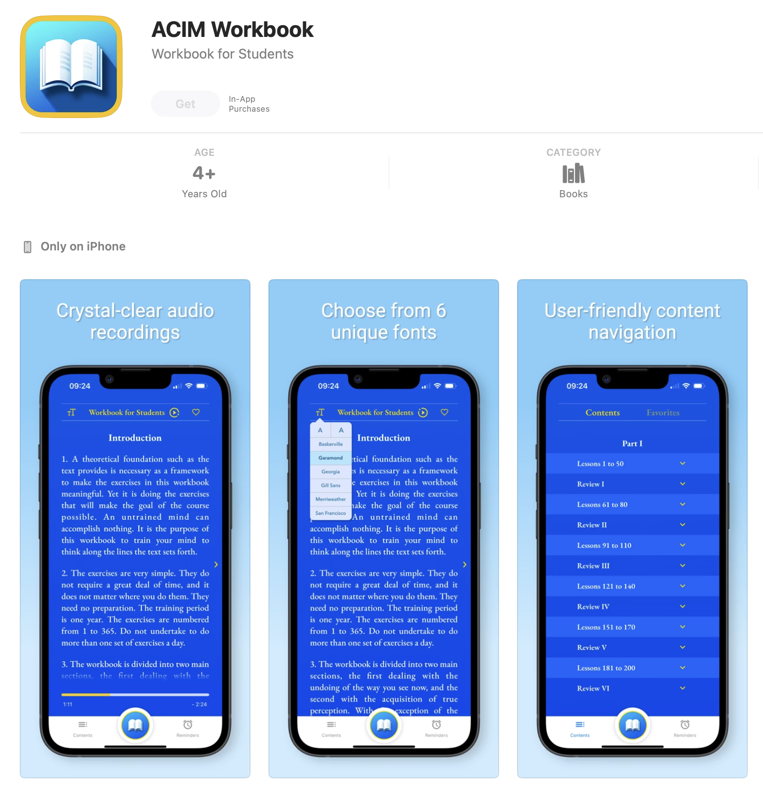
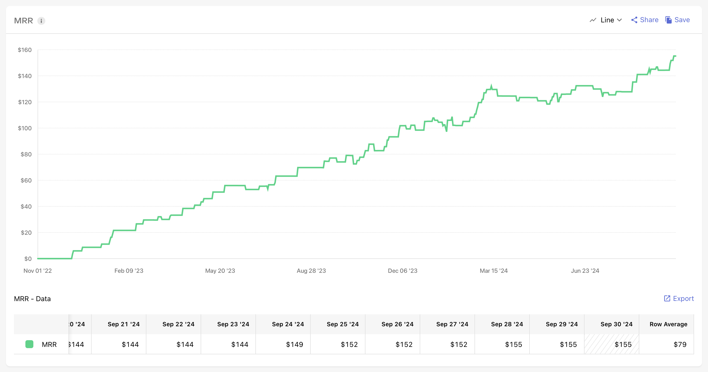

 
**Note**: This is a blank repository intended to showcase the README and screenshots for the ***ACIM Workbook app***.
The actual source code is maintained in a private repository to safeguard the application's security and because it is not released as open-source.

 

# 📖 ACIM Workbook App

The ACIM Workbook app provides users with daily lessons from the workbook section of *A Course in Miracles*. Designed to be intuitive and user-friendly, this app helps users stay consistent with their practice while offering a simple and clean interface.

[Available in the App Store](https://apple.co/4cWbCfY)  

## 🌟 Features

- **Daily Workbook Lessons**: Users can access the full workbook lesson schedule and read lessons directly from the ACIM Workbook text.
- **Notifications and Reminders**: Custom reminders help users stay on track with their lessons throughout the day.
- **Favorite Lessons**: Users can mark lessons as favorites, allowing quick access to lessons they want to revisit.
- **Audio Narration**: Crystal-clear audio narration of each lesson, available at the tap of a button.
- **Font Customization**: Six different font options allow users to personalize their reading experience.
- **User-Friendly Interface**: Simple and intuitive navigation using React Native components.
- **Subscriptions**: Monthly and yearly subscription plans are available, implemented using RevenueCat, giving full access to all lessons.

---

## 🛠️ Technologies Used

- **React Native**: JavaScript framework for building native mobile apps using JavaScript and React components.
- **React Navigation**: Smooth and flexible screen transitions.
- **Push Notifications**: Custom notifications using third-party services to send reminders.
- **React Native Track Player**: Used for audio playback of lesson narrations.
- **AsyncStorage**: Local data storage to save lesson progress and user settings.
- **Custom Design**: Built custom UI elements to enhance user experience, ensuring responsiveness and accessibility.
- **In-App Purchases**: Subscription model implemented using RevenueCat to manage monthly and yearly subscriptions, giving users full access to all lessons.

---

## 📈 App Growth

The ACIM Workbook app has been generating consistent sales, with steady growth in Monthly Recurring Revenue (MRR). Over time, the app has built a solid and loyal user base, as demonstrated by the upward trend in the MRR graph. This consistent increase reflects the app's value to users and the success of the subscription model.

