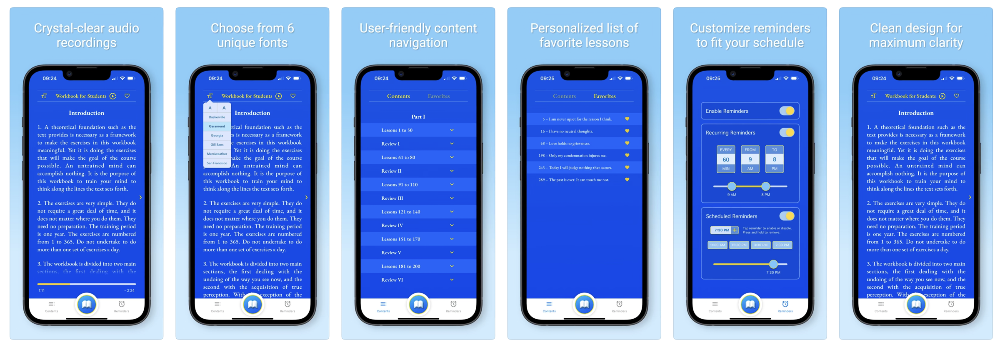

**Note**: This is a blank repository created to showcase the README and screenshots for the ACIM Workbook app. The actual code is maintained in a private repository.

# ACIM Workbook App

The ACIM Workbook app provides users with daily lessons from the workbook section of *A Course in Miracles*. Designed to be intuitive and user-friendly, this app helps users stay consistent with their practice while offering a simple and clean interface.

**Features**

- **Daily Workbook Lessons**: Users can access the full workbook lesson schedule and read lessons directly from the ACIM text.
- **Notifications and Reminders**: Custom reminders help users stay on track with their lessons throughout the day.
- **Progress Tracking**: The app automatically marks lessons as completed and displays user progress over time.
- **Audio Narration**: Crystal-clear audio narration of each lesson, available at the tap of a button.
- **Font Customization**: Six different font options allow users to personalize their reading experience.
- **User-Friendly Interface**: Simple and intuitive navigation using React Native components.
- **Subscriptions**: Monthly and yearly subscription plans are available, implemented using RevenueCat, giving full access to all lessons.

---

**Technologies Used**

- **React Native**: Cross-platform development for both Android and iOS.
- **Redux**: State management for user data and progress tracking.
- **React Navigation**: Smooth and flexible screen transitions.
- **Push Notifications**: Custom notifications using third-party services to send reminders.
- **Custom Design**: Built custom UI elements to enhance user experience, ensuring responsiveness and accessibility.
- **AsyncStorage**: Local data storage to save lesson progress and user settings.

---

**App Growth**

The ACIM Workbook app has been generating consistent sales, with steady growth in Monthly Recurring Revenue (MRR). Over time, the app has built a solid and loyal user base, as demonstrated by the upward trend in the MRR graph. This consistent increase reflects the app's value to users and the success of the subscription model.

